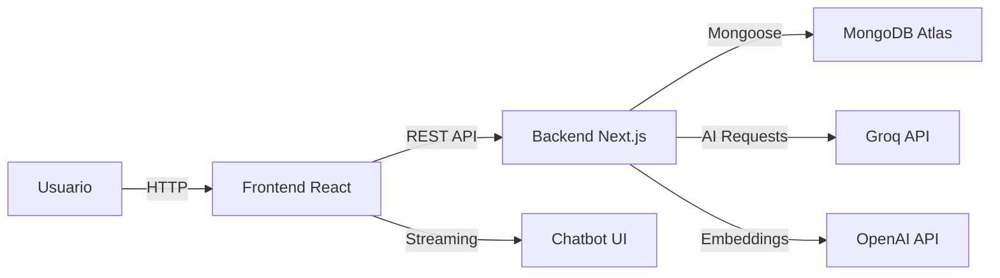

<div align="center">

# Blog RedTickets 

### Sistema de Gestión de Contenidos con IA Conversacional

Plataforma headless CMS con chatbot inteligente, búsqueda semántica y Generative UI. Construida con tecnologías modernas para escalabilidad y rendimiento. Proyecto Final para la licenciatura en Diseño Multimedia de la Universidad ORT Uruguay.

[](https://nodejs.org/)
[](https://react.dev/)
[](https://payloadcms.com/)
[](https://www.mongodb.com/atlas)
[](https://www.typescriptlang.org/)
[](./SECURITY.md)

[Instalación](#-inicio-rápido) · [Documentación](./DEPLOY-GUIDE.md) · [Chatbot](./DOCUMENTACION-CHATBOT.md) · [Seguridad](./SECURITY.md)

</div>

---

## 🚀 Descripción General

**RedTickets Blog** es una plataforma de gestión de contenidos empresarial que combina la potencia de Payload CMS con capacidades avanzadas de IA conversacional. Diseñada para ofrecer experiencias de usuario excepcionales con respuestas inteligentes en tiempo real.

### Características Principales

🧠 **IA Conversacional Avanzada**  
Chatbot powered by Groq (Llama 3.1-8b-instant) con streaming de respuestas y Generative UI contextual

🎨 **Interfaz Dinámica Generativa**  
Sistema de componentes visuales que se adaptan al contexto de la conversación en tiempo real

📊 **Arquitectura Headless**  
Separación completa frontend/backend con API REST/GraphQL auto-generadas por Payload CMS

🔍 **Búsqueda Semántica**  
Embeddings con OpenAI para búsqueda inteligente de contenido relevante

💬 **Sistema de Comentarios**  
Moderación automática con análisis de sentimiento y detección de toxicidad

📱 **100% Responsive**  
Diseño mobile-first con experiencia optimizada para todos los dispositivos

⚡ **Rendimiento Optimizado**  
Vite + React 19 para tiempos de carga ultrarrápidos y hot reload instantáneo

🛡️ **Seguridad Enterprise**  
Autenticación JWT, CORS configurado, protección CSRF y análisis de contenido

---

## Tabla de Contenidos

- [Stack Tecnológico](#-stack-tecnológico)
- [Inicio Rápido](#-inicio-rápido)
- [Arquitectura](#-arquitectura)
- [Chatbot con IA](#-chatbot-con-ia)
- [API y Endpoints](#-api-y-endpoints)
- [Despliegue](#-despliegue)
- [Documentación](#-documentación)

---

## 🛠️ Stack Tecnológico

### Backend

- **Framework**: Next.js 15.4.8 (App Router)
- **CMS**: Payload CMS 3.59.1
- **Base de Datos**: MongoDB Atlas (Mongoose adapter)
- **IA**: Groq AI (Llama 3.1-8b-instant)
- **SDK**: Vercel AI SDK v5
- **Embeddings**: OpenAI API
- **Runtime**: Node.js 20.19.5

### Frontend

- **Framework**: React 19.1.2
- **Build Tool**: Vite 5
- **Router**: React Router 6
- **Estilos**: CSS Modules + Animaciones CSS
- **HTTP Client**: Fetch API con streaming

### DevOps

- **Tests**: Vitest + Playwright
- **Deploy**: Render.com (Blueprint automation)
- **CI/CD**: GitHub Actions ready
- **Container**: Docker support incluido

---

## ⚡ Inicio Rápido

### Prerequisitos

| Herramienta   | Versión   | Enlace                                                      |
| ------------- | --------- | ----------------------------------------------------------- |
| Node.js       | 20.19.5+  | [Descargar](https://nodejs.org/)                            |
| MongoDB Atlas | Free Tier | [Registrarse](https://www.mongodb.com/cloud/atlas/register) |
| Groq API Key  | Gratuita  | [Obtener Key](https://console.groq.com/)                    |

> **📚 Guía de Seguridad**: Ver [SECURITY.md](./SECURITY.md) para obtener tus credenciales de forma segura.

### Instalación en 3 Pasos

#### 1️⃣ Configurar Backend

```bash
cd backend
npm install

# Configurar variables de entorno
cp .env.example .env
# ⚠️ IMPORTANTE: Editar .env con TUS credenciales reales
# Ver SECURITY.md para obtenerlas

# Cargar contenido inicial
npm run seed

# Iniciar servidor de desarrollo
npm run dev
```

✅ **Admin Panel**: http://localhost:3000/admin  
✅ **API Docs**: http://localhost:3000/api

#### 2️⃣ Configurar Frontend

```bash
cd frontend
npm install

# Configurar API endpoints
cp .env.example .env
# Verificar VITE_API_URL apunta al backend

# Iniciar aplicación
npm run dev
```

✅ **Blog**: http://localhost:5173  
✅ **Chatbot**: Disponible en todas las páginas

#### 3️⃣ Configuración Inicial

1. Accede al Admin Panel: http://localhost:3000/admin
2. Crea tu usuario administrador
3. Verifica el contenido en **Collections > ContenidoBlog**
4. Abre el blog y prueba el chatbot 💬

### Verificación de Instalación

```bash
# Verificar contenido
curl http://localhost:3000/api/contenido-blog

# Frontend build
cd frontend && npm run build
```

---

## 🏗️ Arquitectura

### Flujo de Datos



### Estructura del Proyecto

```
redtickets/
├── backend/                    # Payload CMS + Next.js API
│   ├── src/
│   │   ├── collections/        # Modelos de datos (Collections)
│   │   │   ├── ContenidoBlog.ts    # Contenido estructurado por secciones
│   │   │   ├── Comments.ts         # Sistema de comentarios + análisis
│   │   │   ├── Users.ts            # Autenticación y usuarios
│   │   │   └── Media.ts            # Gestión de archivos
│   │   ├── app/api/
│   │   │   ├── chat-structured/   # Chatbot con Generative UI
│   │   │   └── [...slug]/         # Auto-generated Payload API
│   │   ├── utils/
│   │   │   └── analizarTexto.ts   # Análisis de sentimiento
│   │   └── payload.config.ts      # Configuración CMS
│   ├── tests/                  # Tests de integración y E2E
│   └── seed-contenido.js       # Script de carga inicial
│
├── frontend/                   # React SPA
│   ├── src/
│   │   ├── components/
│   │   │   ├── ChatUI.jsx         # Interfaz del chatbot
│   │   │   ├── chatbot/           # Componentes de Generative UI
│   │   │   │   ├── CardList.jsx
│   │   │   │   ├── ImageGallery.jsx
│   │   │   │   └── VideoBlock.jsx
│   │   │   └── SectionContent.jsx  # Renderizador de secciones
│   │   ├── hooks/
│   │   │   ├── useSimpleChat.js   # Chat con text commands
│   │   │   └── useStructuredChat.js # Chat con JSON streaming
│   │   ├── pages/
│   │   │   ├── Home.jsx           # Página principal
│   │   │   └── SectionPage.jsx    # Template de secciones
│   │   └── services/
│   │       └── api.js             # Cliente HTTP
│   └── vite.config.js
│
└── render.yaml                 # Blueprint de despliegue automático
```

### Collections (Modelos de Datos)

#### ContenidoBlog

Sistema único de sección única (1 documento = 1 sección del sitio)

```typescript
{
  seccion: 'inicio' | 'sobre_nosotros' | 'servicios' | 'comunidad' | 'ayuda' | 'contacto',
  titulo: string,
  descripcion: string,
  // Campos condicionales según sección
  estadisticas?: { transacciones, eventos_realizados, productores },
  fundadores?: [{ nombre, cargo, imagen }],
  equipo?: [{ nombre, area, imagen }],
  eventos?: [{ titulo, fecha, descripcion, imagen }],
  faqs?: [{ pregunta, respuesta }]
}
```

#### Comments

Sistema de comentarios con moderación automática

```typescript
{
  author: string,
  comment: string,
  eventRef?: string,
  sentimentScore: number,      // -1 a 1 (calculado automáticamente)
  toxicityScore: number,       // 0 a 1 (calculado automáticamente)
  status: 'pendiente' | 'publicado' | 'rechazado'
}
```

---

## 🤖 Chatbot con IA

### Características del Chatbot

| Característica    | Descripción                                |
| ----------------- | ------------------------------------------ |
| **Motor de IA**   | Groq Cloud (Llama 3.1-8b-instant)          |
| **Arquitectura**  | 5 Archetypes + 5 Layers de respuesta       |
| **Streaming**     | Respuestas incrementales con Vercel AI SDK |
| **Generative UI** | Componentes React generados dinámicamente  |
| **Fallback**      | Respuestas offline si falla la API         |
| **Contexto**      | Conocimiento completo del sitio            |

### Arquitectura del Chatbot

```typescript
// Flujo de conversación
Usuario → ChatUI.jsx
       → useStructuredChat hook
       → POST /api/chat-structured
       → Groq streamText() con JSON schema
       → Respuesta estructurada con layers
       → Parser JSON en frontend
       → Renderizado de componentes visuales
```

### Respuestas Estructuradas (Generative UI)

El chatbot genera respuestas siguiendo una arquitectura de layers:

```json
{
  "archetype": "discover",  // discover | compare | inform | handoff | redirect
  "layers": {
    "visual": [              // Componentes UI
      {
        "type": "card-list",
        "cards": [
          { "title": "Servicio 1", "description": "...", "action": {...} }
        ]
      }
    ],
    "acknowledge": {
      "text": "Entiendo que buscas información sobre..."
    },
    "context": {
      "text": "Nuestros servicios incluyen..."
    },
    "insight": {
      "text": "Te recomiendo comenzar por..."
    },
    "nextSteps": [           // Máximo 3 acciones
      { "type": "navigate", "label": "Ver Servicios", "target": "/seccion/servicios" }
    ]
  }
}
```

### Componentes Visuales Disponibles

- **CardList**: Lista de opciones con acciones (servicios, productos)
- **ImageGallery**: Grid de imágenes (equipo, galería)
- **ImageBlock**: Imagen única con caption
- **VideoBlock**: Video embebido (tutorial de compra)

### Endpoints del Chatbot

| Endpoint               | Método | Descripción                                       |
| ---------------------- | ------ | ------------------------------------------------- |
| `/api/chat-structured` | POST   | Chat con Generative UI (JSON streaming)           |

**Documentación completa**: [DOCUMENTACION-CHATBOT.md](./DOCUMENTACION-CHATBOT.md)

---

## 🌐 API y Endpoints

### Payload CMS API (Auto-generada)

Todos los endpoints REST y GraphQL se generan automáticamente:

```bash
# Collections
GET    /api/contenido-blog          # Listar contenido
GET    /api/contenido-blog/:id      # Obtener por ID
POST   /api/contenido-blog          # Crear (requiere auth)
PATCH  /api/contenido-blog/:id      # Actualizar (requiere auth)
DELETE /api/contenido-blog/:id      # Eliminar (requiere auth)

GET    /api/comments                # Listar comentarios
POST   /api/comments                # Crear comentario (público)

GET    /api/media                   # Listar archivos
POST   /api/media                   # Subir archivo (requiere auth)

# GraphQL
POST   /api/graphql                 # Endpoint GraphQL
GET    /api/graphql-playground      # Playground interactivo
```

### Query Parameters

```bash
# Filtros
GET /api/contenido-blog?where={"seccion":{"equals":"inicio"}}

# Paginación
GET /api/contenido-blog?page=1&limit=10

# Ordenamiento
GET /api/contenido-blog?sort=-createdAt

# Profundidad (populate relations)
GET /api/contenido-blog?depth=2

# Selección de campos
GET /api/contenido-blog?select=titulo,descripcion
```

### Custom Endpoints

```bash
# Chatbot
POST   /api/chat-structured         # Chat con Generative UI

# Utilidades
POST   /api/seed-contenido          # Cargar contenido inicial (dev)
POST   /api/reset-contenido         # Resetear base de datos (dev)
GET    /api/check-users             # Verificar usuarios existentes
```

### Ejemplo de Uso (JavaScript)

```javascript
// Obtener contenido de una sección
const response = await fetch(
  "http://localhost:3000/api/contenido-blog?where[seccion][equals]=inicio",
);
const data = await response.json();
console.log(data.docs[0]);

// Crear comentario
const comment = await fetch("http://localhost:3000/api/comments", {
  method: "POST",
  headers: { "Content-Type": "application/json" },
  body: JSON.stringify({
    author: "Juan Pérez",
    comment: "Excelente evento!",
    eventRef: "evento-id-123",
  }),
});

// Chat con streaming
const response = await fetch("http://localhost:3000/api/chat-structured", {
  method: "POST",
  headers: { "Content-Type": "application/json" },
  body: JSON.stringify({
    messages: [{ role: "user", content: "¿Qué servicios ofrecen?" }],
  }),
});
const reader = response.body.getReader();
// ... procesar stream
```

---

## 🚀 Despliegue

### Opción 1: Vercel
Backend (Admin Panel)
https://redtickets-backend.vercel.app/
Requiere autenticación

Frontend (Blog público)
https://blog-redtickets.vercel.app/

### Opción 2: Render 
Backend (Admin Panel)
https://redtickets-backend.onrender.com
Requiere autenticación

Frontend (Blog público)
https://redtickets-frontend.onrender.com

---

## 📚 Documentación

### Guías Completas

| Documento                                                            | Descripción                                              |
| -------------------------------------------------------------------- | -------------------------------------------------------- |
| [DEPLOY-GUIDE.md](./DEPLOY-GUIDE.md)                                 | Guía completa de despliegue en Render con GitHub Actions |
| [DOCUMENTACION-CHATBOT.md](./DOCUMENTACION-CHATBOT.md)               | Arquitectura detallada del chatbot y Generative UI       |
| [STRUCTURED-CHAT-GUIDE.md](./STRUCTURED-CHAT-GUIDE.md)               | Especificaciones del sistema de chat estructurado        |
| [SECURITY.md](./SECURITY.md)                                         | 🔒 Guía de seguridad para contribuidores                 |
| [.github/copilot-instructions.md](./.github/copilot-instructions.md) | Instrucciones para desarrollo con GitHub Copilot         |

### Referencias Externas

- [Payload CMS Documentation](https://payloadcms.com/docs) - Collections, Hooks, Authentication
- [Vercel AI SDK](https://sdk.vercel.ai/docs) - streamText, useChat patterns
- [Groq Cloud Documentation](https://console.groq.com/docs) - Modelos, Rate limits, Best practices
- [Next.js 15 Docs](https://nextjs.org/docs) - App Router, API Routes, Deployment
- [React 19 Docs](https://react.dev) - Hooks, Components, Performance
- [MongoDB Atlas Guide](https://www.mongodb.com/docs/atlas/) - Cloud database, Security
- [Vite Documentation](https://vitejs.dev/) - Build optimization, Plugins

### API Reference

- **Payload REST API**: `http://localhost:3000/api/<collection-name>`
- **GraphQL Playground**: `http://localhost:3000/api/graphql-playground`
- **Admin Panel**: `http://localhost:3000/admin`

---

<div align="center">

**Construido con ❤️ por Iara Suster**

[⬆ Volver arriba](#-redtickets-blog-platform)

</div>
